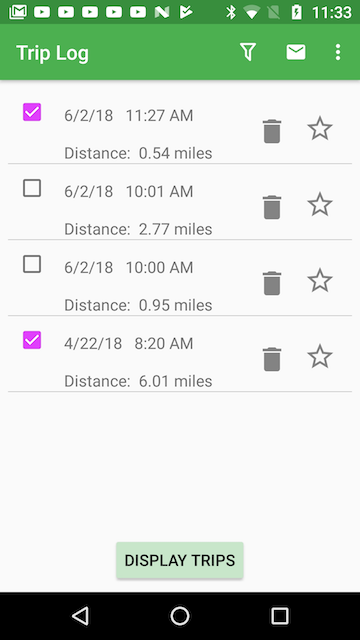
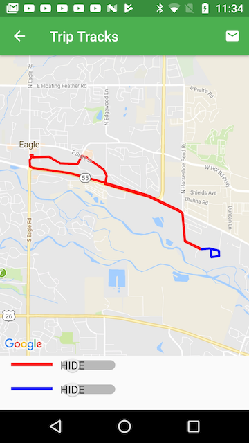
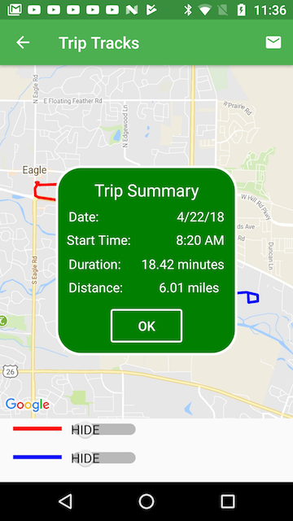
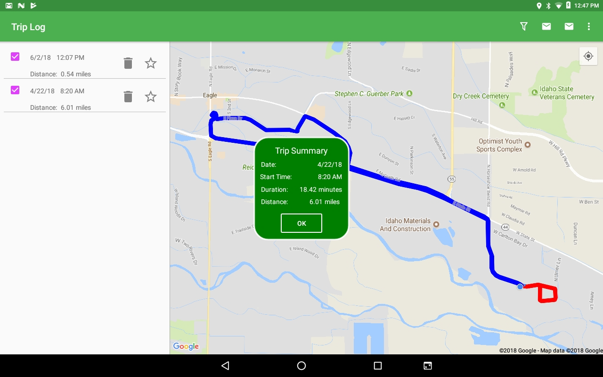
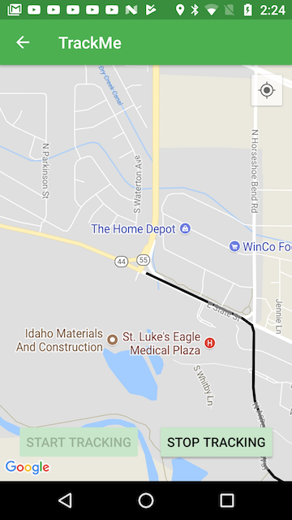
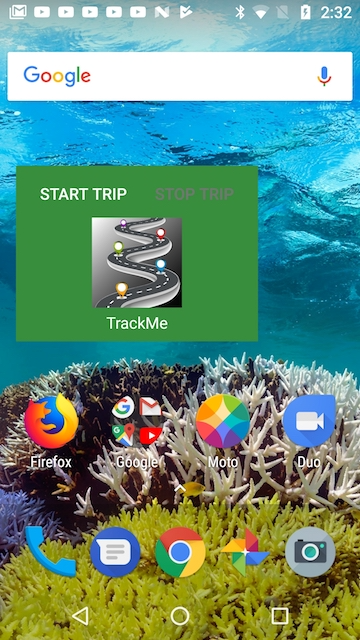
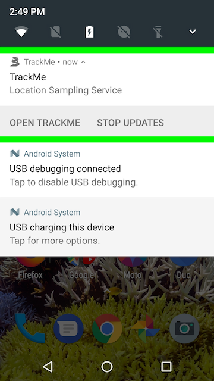
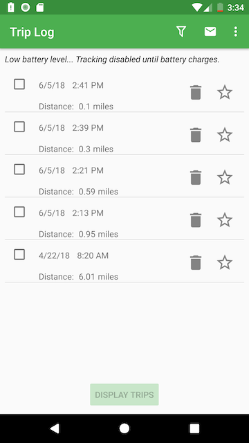

# Udacity CapstoneProject (*TrackMe*)
*TrackMe* is my final project for [Udacity's Android Developer Nanodegree Program](https://www.udacity.com/course/android-developer-nanodegree-by-google--nd801 ).

*TrackMe* provides trip tracking which when activated tracks and records the user's movement. Trip tracking can be used to help track vehicle usage, provide data for trip reports, or compare differences in daily routes that are frequented by the user.

## User Notes
*TrackMe* provides two principal features, a trip log to display information about trips that have been saved and a trip tracker for capturing new trip data. Trip tracking is initated using the "New Trip" menu item or using the app widget that is installed with the app. 

### Trip Log
After the user grants for the app to use location services the app's top level view is the trip log screen (phone version) shown here:

The Trip Log is a list of previously recorded trips. The log can be filtered by date range or to only include trips that have been marked as favorites. The trip log can also be sorted by trip date or trip distance using the Sort menu item.  Trips can be deleted using the trash can or favored using the Star icon.

*Installation Note:* TrackMe installs with a sample trip saved in the database which can be used to explore the functionality of the app without having to take a trip to collect data. The sample trip can be deleted when it is no longer needed.

Up to four trips can be selected for viewing on a map and to obtain additional trip details. Check the boxes on the left corresponding to the trips as illustrated in the trip log image above and tap the "Display Trips" button to see plots of the selected trips. Here is an example of two selected trips being displayed:

When viewing trip tracks, a track can be selected by tapping on plotted track line which results in the trip details to be displayed in a pop up window:

On tablets, when in landscape mode, these views are combined in a single window pane:

### Trip Tracking
Trip tracking records the location and movement of the user creating a new trip. From the menu choose "New Trip" and the tracking screen is displayed with the user's current position centered in the window. Use the "Start Tracking" button to begin capturng and plotting the trip. Here is a sample screen shot of a trip being recorded:

The trip is completed when the user taps the "Stop Tracking" button. Tracking can also be initiated using the desk top app widget:  

##Tracking Service
The tracking service continues to run if the user pauses the app using the Android Home button and exits to the Home Screen. If the user exits the tracking screen with either the Up button or the Back button tracking stops and the trip is completed.  If the Home button is used, the tracking service continues executing and a notification is posted to the notification tray. The notification indicates the tracking service is running while the app is paused and provides a mechanism to stop the tracking service and open the app. Here is a screen shot of the notification:

The notification is removed if the user resumes using the app in the foreground where the plot of the trip being tracked is displayed. No other screen of the app is accessible while the app is tracking.  

### Battery Usage
Generally, in a vehicle, fine grain location data is priovided by GPS, perhaps augmented with cell tower data if the device has cellular connectivity.  GPS updates consume battery power.  If the device is powered within the vehicle the battery will charge and offset the GPS drain.

However, the app monitors battery consumption and disables tracking if the battery level falls below 15%. At this low battery state, any active location service is stopped and new trip tracking cannot be initiated until the battery is charged and comes out of the low battery charge state.

Here is a screenshot of a low battery state:

  

